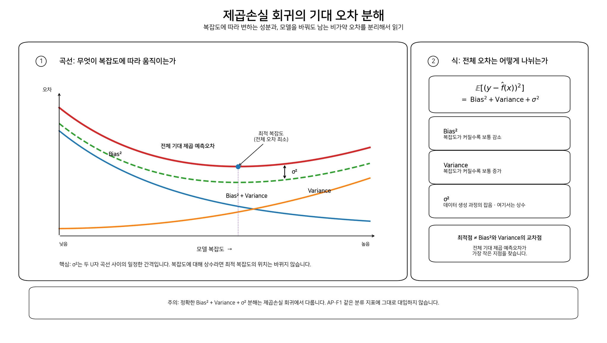
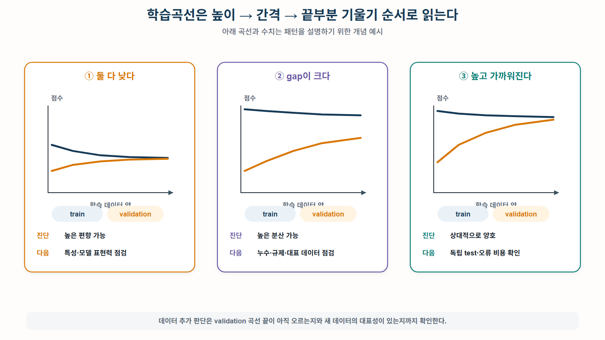

# 제목

## 오늘의 질문

학습을 시작하게 된 질문이나 해결하려던 문제를 작성합니다.

## 핵심 결론

이 글의 결론을 먼저 작성합니다.

> 한두 문장만 읽어도 핵심 내용을 파악할 수 있도록 작성합니다.

## 개념 정리

모델의 train과 validation 결과를 보고 다음 중 무엇을 바꿔야 하는지 결정하는 것이 목표다

- 데이터를 더 모을 것인가
- 특성을 개선할 것인가
- 모델 복잡도를 높이거나 낮출 것인가
- 규제를 조정할 것인가
- 데이터 분할과 누수를 먼저 의심할 것인가

이를 위해 두 도구를 분리한다

- 학습곡선: 훈련 데이터 양만 바꾼다
- 검증곡선: 하이퍼파라미터 하나만 바꾼다.

핵심 1. 편향과 분산은 한 번 학습한 모델 하나만 보고 정확히 측정하는 개념이 아니다.

같은 문제에 대해 학습 데이터를 조금씩 바꾸며 모델을 다시 학습했을 때:

- 평균적으로 어디를 예측하는가 -> 편향
- 예측이 얼마나 흔들리는가 -> 분산

를 보는 개념이다.

핵심 2. 과소적합과 고편향, 과적합과 고분산은 관련 있지만 완전한 동의어는 아니다.

일반적으로:

- 과소적합 모델은 고편향인 경우가 많고
- 과적합 모델은 고분산인 경우가 많다.

하지만 편향 및 분산은 반복 학습에 관한 통계적 성질이고, 과소적합 및 과적합은 실제 성능에서 관찰되는 상태이다.

핵심 3. train-validation gap 만 보면 안된다.

작은 gap이 항상 좋은 것은 아니다.

train AP = 0.47
valid AP = 0.44
gap = 0.03

gap은 작지만 둘 다 낮으므로 좋은 모델이 아니라 고편향 후보이다.

반대로:

train AP = 0.93
valid AP = 0.61
gap = 0.32

train은 높은데 validation이 낮으므로 고분산 또는 누수 및 분할 문제 후보이다.

핵심 4. 학습곡선은 "데이터를 더 모을 가치가 있는가?"를 묻는다

모델은 고정하고 데이터 양만 늘린다.

특히 다음 세 가지를 순서대로 본다.

1. 점수의 절대적인 높이
2. train-validation gap
3. 오른쪽 끝 validation 곡선의 기울기

핵심 5. 검증곡선은 "복잡도를 어디까지 허용할 것인가?"를 묻는다

데이터와 평가 절차를 고정한 뒤 max_depth 같은 하이퍼파라미터 하나만 바꾼다.

최고 validation 점수만 찾지 않고 다음을 함께 본다.

1. validation 평균
2. train-validation gap
3. fold 간 변동
4. 계산 비용과 단순성

핵심 6. LLM 로그에서는 그룹 누수가 특히 중요하다

같은 문서의 여러 청크, 같은 사용자, 같은 대화가 train과 validation에 나뉘어 들어가면 모델이 사실상 비슷한 사례를 이미 본 상태가 된다.

StratifiedKFold는 클래스 비율만 맞춰줄 뿐, 이런 그룹 누수는 막지 못한다.

### 전체 그림: 진단은 "원인 확정"이 아니라 "다음 실험 선택"

모델을 만들었는데 validation 성능이 좋지 않다고 해보자.

이때 가능한 원인은 하나가 아니다.

validation 성능이 낮다

- 모델이 너무 단순하다
- 입력 특성에 필요한 정보가 없다
- 라벨이 모호하거나 잘못됐다
- 모델이 훈련 데이터의 잡음까지 외웠다
- 데이터가 너무 적다
- train과 validation의 분포가 다르다
- 분할에 누수가 있거나 특정 그룹이 몰렸다.

따라서 곡선은 판결문이 아니다.

"이 모델은 반드시 고편향이다"라고 단정하는 도구가 아니라,
"다음에는 데이터, 특성, 모델, 규제, 분할 중 무엇을 바꿔볼 것인가?를 정하는 증거이다.

실험 설계 원칙은 한 번에 하나의 축만 바꾸는 것이다.

도구 바꾸는 것 고정하는 것 답하려는 질문
학습곡선 훈련 샘플 수 모델, 하이퍼파라미터, CV, 지표 대표 데이터를 더 모으면 개선될까?
검증곡선 하이퍼파라미터 하나 데이터, CV, 지표, 나머지 설정 복잡도를 어디까지 허용할까?

데이터 양과 max_depth를 동시에 바꾸면 성능 향상이 어느 쪽 때문인지 알 수 없다.

### 편향과 분산

용어를 먼저 분리해보자

용어 정확한 의미

편향 Bias 모델이 평균적으로 정답에서 한쪽 방향으로 빗나가는 정도
분산 Variance 학습 데이터가 바뀔 때 모델의 예측이 흔들리는 정도
과소적합 Underfitting 모델이 실제 패턴을 충분히 표현하지 못하는 상태
과적합 Overfitting 훈련 데이터의 우연한 패턴과 잡음까지 학습한 상태

여기서 편향은 신경망의 Wx + b 에 있는 학습 가능한 bias parameter b 와 전혀 다른 개념이다.

- Wx + b 의 b : 뉴런이 학습하는 파라미터
- bias-variance의 bias: 반복 학습한 모델 예측의 체계적인 오차

같은 입력 x 에 대해 학습 데이터를 바꿔가며 모델을 다시 학습했을 때, 각 모델이 내놓은 예측 하나가 점 하나이다.

따라서 두 가지를 따로 본다.

중심: 편향

점구름의 평균 위치가 과녁 중심에서 멀수록 편향이 크다.

퍼짐: 분산

점들이 서로 넓게 흩어져 있을수록 분산이 크다.

상태 해석
낮은 편향과 낮은 분산 평균적으로 맞고 재학습해도 안정적
높은 편향 낮은 분산 늘 비슷하게 틀림
낮은 편향 높은 분산 평균은 맞지만 데이터에 따라 크게 흔들림
높은 편향 높은 분산 평균도 틀리고 예측도 불안정

즉, 안정적이라고 좋은 모델은 아니다.

항상 같은 방향으로 틀리는 모델은 안정적이지만 고편향이다

작은 숫자 예제

이상적인 양성 확률이 0.70이라고 하자

모델 A

학습 데이터를 바꿔 다섯 번 학습한 결과:

0.41, 0.42, 0.43, 0.42, 0.41

평균은:

0.418

정답 0.70에 비해:

Bias = 0.418 - 0.70 = -0.282
Bias^2 = 0.0795

예측들은 거의 0.42 주변에 모여 있으므로 분산은 매우 작다.

Variance = 0.000056

즉:

매우 안정적이지만 일관되게 낮게 예측하는 고편향 모델

이다.

모델 B

0.20, 0.95, 0.35, 0.85, 0.65

평균은:

0.60

따라서

Bias = -0.10
Bias^2 = 0.01

평균은 모델 A보다 정답에 가깝지만, 값이 0.20 부터 0.95 까지 크게 흔들린다

Variance = 0.082

즉:

평균적인 방향은 더 정확하지만 학습 데이터에 지나치게 민감한 고분산 모델

이다.

### 제곱오차의 편향-분산 분해

고정된 입력 x 에서 실제 값을 다음과 같이 표현한다.

y = f(x) + 엡실론

여기서

- f(x): 데이터 생성 과정의 진짜 평균적인 관계
- 엡실론: 관측 잡음
- D: 무작위로 뽑힌 학습 데이터
- f햇_D(x): 데이터 D로 학습한 모델의 예측
- E[엡실론] = 0
- Var(엡실론) = 시그마^2

기대 제곱 예측오차는 다음처럼 나뉜다.

\(\mathbb E_{D,\epsilon}
\left[
(y-\hat f_D(x))^2
\right]
=
\underbrace{
\left(
f(x)-\mathbb E_D[\hat f_D(x)]
\right)^2
}_{Bias^2}
+
\underbrace{
\mathbb E_D
\left[
\left(
\hat f_D(x)-\mathbb E_D[\hat f_D(x)]
\right)^2
\right]
}_{Variance}
+
\underbrace{\sigma^2}_{Irreducible\ noise}\)

첫 번째 항: 편향^2

\(\left(f(x)-E_D[\hat f_D(x)]\right)^2\)

여러 학습 데이터를 사용해 모델을 반복 학습했을 때, 평균적인 모델 예측이 진짜 함수에서 얼마나 떨어져 있는가 이다.

두 번째 항: 분산

\(E_D\left[(\hat f_D(x)-E_D[\hat f_D(x)])^2\right]\)

각각의 학습 데이터로 만든 모델이 평균 모델 예측 주변에서 얼마나 흔들리는가 이다.

세 번째 항: 비가약 오차

시그마^2

모델을 아무리 개선해도 제거할 수 없는 데이터 생성 과정의 잡음이다.

예를 들어 동일한 LLM 답변을 평가자마다 다르게 판정한다면, 입력만으로 완벽히 예측할 수 없는 부분이 생길 수 있다.

왜 교차항은 사라지는가

식을 전개하면 여러 교차항이 나오지만:

- f햇_D(x) - E_D[f햇_D(x)]의 평균은 0이고
- 잡음의 조건부 평균도 0이라고 가정하므로

기대값을 취하면 교차항이 0이된다.

수식 증명 자체보다 현재는 다음을 이해하면 충분하다

전체 오차에는
평균적으로 잘못된 부분, 데이터에 따라 흔들리는 부분, 모델로 제거할 수 없는 잡음이 모두 포함된다.

### 복잡도와 편향 및 분산

전형적인 고전적 그림에서는 모델 복잡도가 증가할수록:
- 편향은 감소
- 분산은 증가

예를 들어 결정트리라면:

- 깊이 1: 표현 가능한 규칙이 적음 -> 고편항 위험
- 깊이 20: 세밀한 규칙까지 표현 -> 고분산 위험

그래서 전체 오차가 U자 형태를 보이는 영역을 설명한다



하지만 세 가지 주의가 필요하다

1. 실제 validation 곡선이 매끄러운 U자라고 보장되지 않는다.
2. Bias^2 + Variance + 시그마^2 분해는 제곱오차 회귀에 대한 식이다. AP나 F1에 그대로 대입하지 않는다.
3. 대표 데이터, 좋은 특성, 적절한 앙상블은 편향과 분산을 동시에 개선할 수도 있다.

따라서 "편향을 1 줄이면 분산이 반드시 1 증가한다" 같은 고정된 교환 관계가 아니다.

### train과 validation 점수로 진단하기

AP가 높을수록 좋은 지표이다.

따라서 다음과 같이 읽는다

Train Validation GAp 1차 진단
낮음 낮음 작음 고편향 및 정보 부족 가능성
높음 낮음 큼 고분산 및 누수, 분포 차이 가능성
높음 높음 작음 개발 단계에서 양호한 후보
낮음 매우 낮음 큼 편향과 분산, 데이터 문제 모두 가능

작은 gap이 항상 좋은 것은 아니다

train AP = 0.47
valid AP = 0.44
gap = 0.03

모델은 train에도 제대로 맞지 못했다.

검토할 것:
- 특성이 실패 원인을 표현하는가
- 모델 표현력이 부족한가
- 규제가 지나치게 강한가
- 라벨이 일관적인가

train이 높다고 성공한 것도 아니다

train AP = 1.00
valid AP = 0.48
gap = 0.52

훈련 데이터를 매우 잘 맞췄지만 새로운 데이터에 일반화하지 못했다.

검토할 것:
- 모델이 너무 복잡한가
- 중복 샘플이 많은가
- 분할 누수가 있는가
- 특정 문서군이 한쪽 fold에 몰렸는가
- 훈련 데이터가 너무 적은가

한 번의 train-validation 분할만으로 편향과 분산을 정확히 측정할 수 는 없으므로, 여러 fold에서 패턴이 제한되는지 확인한다.

### 학습곡선: 데이터를 더 모을 가치가 있는가

정의

학습곡선은 훈련 샘플 수를 늘리면서 train 점수와 validation 점수를 기록한 그래프이다.

이때 모델과 하이퍼파라미터는 그대로 둔다.

x축 = 훈련 샘플 수
y축 = train/validation 성능

학습곡선이 답하는 질문은:

"현재 모델과 설정을 그대로 유지한다고 했을 때,
대표적인 데이터를 더 모으면 validation 성능이 계속 좋아질 가능성이 있는가?"

이다.

### 읽는 순서: 높이 -> 간격 -> 끝부분 기울기



이미지의 세 패널은 전형적인 경우를 보여준다.

1. train과 validation이 모두 낮고 가까움

train - 낮은 곳에서 수렴
validation - 낮은 곳에서 수렴

진단:
- 고편향 가능성
- 데이터만 더 모아도 크게 개선되지 않을 가능성
다음실험:
- 더 좋은 특성
- 더 표현력 있는 모델
- 너무 강한 규제 완화
- 라벨 기준 점검

2. train은 높은데 validation이 낮고 gap이 큼

train 높은 상태
validation 낮지만 데이터가 늘며 상승

진단:
- 고분산 가능성
- 대표 데이터 부족 가능성
- 모델 복잡도 또는 누수 문제 가능성

다음 실험:
- 대표 데이터 추가
- 모델 단순화
- 규제 강화
- 그룹 분할
- 라벨 및 중복 점검

3. 둘 다 높은 곳에서 가까워짐

진단:
- 개발 단계에서는 상대적으로 양호한 후보

다음 단계:
- 독립 test 평가
- 운영 임계값 결정
- 안전 실패 recall 확인
- 허위 경보 비용 확인

좋은 개발 점수는 운영 성공을 자동으로 의미하지 않는다.

### 실습 코드가 실제로 하는 일

```python
sizes, train_scores, valid_scores = learning_curve(
    estimator,
    X_dev,
    y_dev,
    train_sizes=[0.10, 0.25, 0.50, 0.75, 1.00],
    cv=cv,
    scoring="average_precision",
    shuffle=True,
    random_state=42,
    n_jobs=-1,
)
```

sizes

실제로 사용한 훈련 샘플 수이다.
5-fold CV에서 전체 데이터가 1,200개라면 한 fold의 구성은:

train: 960개
validation: 240개

따라서 train_sizes=0.10은 전체 1200개의 10%가 아닌
960개의 10%인 96개

그래서 출력되는 크기는:
[96, 240, 480, 720, 960]

이다.

train_scores와 valid_scores shape

훈련 크기가 5개이고 fold가 5개이므로

train_scores.shape # (5, 5)
valid_scores.shape # (5, 5)

행은 훈련 크기이고 열은 fold이다.

                     fold 1   fold 2   fold 3   fold 4   fold 5
train size 96
train size 240
train size 480
train size 720
train size 960

따라서:

train_scores.mean(axis=1)

은 각 훈련 크기에서 5개 fold 점수를 평균한다.

(5, 5) -> (5,)
axis=1 이기 때문에 열 방향, 즉 fold들을 하나로 평균하는 것이다.

### 결과 해석

결과는 아래와 같다

| train size | train AP | valid AP | gap |
|---:|---:|---:|---:|
| 96 | 0.935 | 0.184 | 0.751 |
| 240 | 0.962 | 0.211 | 0.751 |
| 480 | 0.837 | 0.271 | 0.566 |
| 720 | 0.742 | 0.327 | 0.415 |
| 960 | 0.790 | 0.379 | 0.412 |

두 가지 추세가 동시에 보인다.

데이터 관점

validation AP: 0.184 -> 0.379

데이터를 늘릴수록 validation AP가 계속 상승한다.

따라서:

더 많은 대표성 있는 라벨 데이터가 성능을 높일 가능성이 많이 있다.

라고 볼 수 있다.

모델, 분할 관점

gap: 0.751 -> 0.412

gap은 감소했지만 마지막에도 0.412로 크다

따라서:

데이터만 추가하기보다 모델 단순화, 규제, 특성 품질, 그룹 누수를 동시에 확인해야 한다.

는 결론이다.

즉, 이 결과를 다음처럼 해석하면 잘못이다.

"validation이 오르니까 데이터만 계속 모으면 해결된다."

정확한 해석은:

데이터가 추가가 도움이 될 가능성은 있지만, 여전히 강한 과적합 신고하 남아 있으므로 데이터 추가와 복잡도 감소를 비교 실험해야 한다.

이다.

### train AP가 마지막에 다시 오른 이유

0.742 -> 0.790

이 값이 오른 것은 코드 오류가 아니다.

실제 학습곡선은 아래의 이유로 완전히 단조롭지 않을 수 있다.

- 훈련 부분집합 구성이 달라짐
- fold별 데이터 난도가 다름
- 양성 샘플 수가 적어 AP가 흔들림
- 결정트리의 분할 구조가 표본 변화에 민감함

중요한 것은 한 점의 작은 반전보다 전체 추세이다.

### 오른쪽 끝의 기울기가 중요한 이유

validation이 끝까지 계속 상승

대표 데이터를 더 모을 가치가 남아 있을 가능성이 크다.

단, 새 데이터가 기존 데이터의 중복이어서는 안된다.

같은 문서의 비슷한 청크 10000개 추가

보다:

새 도메인, 새 문서 유형, 새로운 실패 사례 1000개 추가

가 더 유용할 수 있다.

validation이 낮은 상태로 평평함

같은 유형의 데이터를 더 반복 수집하기보다 다음을 우선한다

- 특성 개선
- 라벨 기준 개선
- 모델 표현력 증가
- 분포와 분할 재검토

validation이 평평하고 gap이 큼

- 중복 데이터
- 라벨 오류
- 그룹 누수
- 지나친 복잡도

를 먼저 의심한다.

### 왜 Accuracy가 아니라 AP인가

실습 데이터에서 실패 사례는 약 12%이다.

모든 사례를 정상이라고 예측하면:

Accuracy 물결= 88%

가 된다.

하지만 실패를 단 한 건도 찾지 못한다.

따라서 accuracy만 사용하면 모델이 좋아 보이는 착시가 생긴다.

Precision

Precision = 실제로 실패인 예측 / 실패라고 예측한 전체 사례

모델이 실패라고 경고한 것 중 실제 실패의 비율이다.

Recall

Recall = 찾아낸 실제 실패 / 전체 실제 실패

실제 실패 사례 중 모델이 얼마나 찾아냈는지이다.

AP

AP는 하나의 임계값으로 자른 결과가 아니라, 모델이 실패 사례를 예측 점수 순위 앞부분에 얼마나 잘 모으는지를 precision-recall 관계로 요약한다.

결정트리 예제에서는:

model.predict_proba(X)[:, 1]

을 사용한다.

- predict_proba(X) : (n_samples, 2)
- [:, 1]: 클래스 1, 즉 실패일 점수
- 결과 shape: (n_samples,)

AP는 이 점수를 높은 순서로 정렬했을 때 실제 실패 사례가 앞부분에 얼마자 잘 배치되는지 평가한다.

AP를 해석할 때

양성 비율이 12%라면 무작위 순위의 AP는 대략 양성 비율인 0.12 주변이다.

따라서 AP=0.38은 무작위보다는 낫지만, 운영 가능한 수준인지는 별도 기준이 필요하다.

또한 AP가 좋아도 확률이 잘 보정되었다는 뜻이 아니다.

실제 실패 확률이 20%인 사례에 모델이 90%를 출력

하더라도 순서만 맞으면 AP는 높을 수 있다.

실패 확률 자체를 운영 의사결정에 사용한다면 calibration도 별도로 확인해야 한다.

### 데이터 분할과 누수

StratifiedKFold가 해주는 것

각 fold의 양성 및 음성 비율을 비슷하게 유지한다.

예를 들어 전체가:

정상 80%
실패 12%

라면 각 fold도 가능한 한 비슷한 비율로 만든다.

하지만 이것만으로는 충분하지 않다.

### LLM 로그에서 발생하는 그룹 누수

다음과 같은 데이터가 있다고 하자

문서 A
├─ chunk 1
├─ chunk 2
├─ chunk 3
└─ chunk 4

무작위 분할을 하면

train: 문서 A의 chunk 1, 2, 3
valid: 문서 A의 chunk 4

가 될 수 있다.

모델은 validation의 문서 A를 처음보는 것이 아니다. 문서의 어휘, 형식, 주제 등을 이미 학습했을ㄹ 수 있다.

비슷한 문제가 다음 단위에서도 발생한다.

- 같은 사용자
- 같은 대화 세션
- 같은 질문의 변형
- 같은 원문 문서에서 만든 청크
- 동일 템플릿으로 생성한 데이터
- 증강된 원본과 증강본

이 경우 validation 점수가 실제 새 문서 성능보다 부풀려진다.

적절한 도구

그룹 격리가 중요하면:

- GroupKFold
- StratifiedGrouopKFold

를 고려한다.

시간 흐름이 있는 운영 로그라면 무작위 CV보다:

과거 데이터로 학습 -> 미래 데이터로 검증

하는 시간 기반 분할이 더 현실적일 수 있다.

### 전처리도 fold 안에서 학습해야 한다

예를 들어 전체 데이터로 먼저 scaler나 TF-IDF vocabulary를 만든 뒤 CV를 하면 validation 정보가 전처리에 들어간다.

따라서:

Pipeline([
    ("preprocessor", preprocessor),
    ("model", model),
])

처럼 전처리기와 모델을 묶어야 한다.

그러면 각 fold마다:

fold train에서 전처리 학습
-> fold train 변환
-> fold validation 변호나
-> 모델 평가

순서로 실행된다.

### 검증곡선: 모델 복잡도를 어디까지 허용할 것인가.

정의

검증곡선은 학습 전에 정하는 하이퍼파라미터 하나를 바꾸며 train과 validation 성능을 비교한다.

이번 강의에서는:

max_depth = [1, 2, 3, 5, 8, 12, 20]

을 바꾼다.

고정되는 것은:

- 개발 데이터
- 5-fold CV
- AP
- 결정트리 모델
- random_state
- 그 외 모든 설정

이다.

### 왜 트리 깊이가 복잡도인가

결정트리는 입력에 질문을 이어 붙힌다.

예:

retrieval_score <= 0.35?
├─ Yes: citation_count <= 0?
│  ├─ Yes: 실패 가능성 높음
│  └─ No: ...
└─ No: prompt_length > 850?
   ├─ Yes: ...
   └─ No: ...

깊이 1

질문 한 단계만 가능하다.

완전한 이진트리라면 최대 잎은:

2^1 = 2

규칙이 단순해 과소적합할 수 있다.

깊이 3

질문을 최대 세 단계 연결한다.

완전한 이진트리라면 최대 잎은:

2^3 = 8

여러 특성의 비선형 조합을 표현할 수 있다.

깊이 제한 없음

세부적인 예외 규칙까지 계속 분기할 수 있다.

훈련 데이터의 우연한 패턴을 외울 위험이 커진다.

### 검증 곡선 코드의 shape


## 직접 확인

```python
# 직접 실행한 최소 예제
```

실행 결과:

```text
실행 결과
```

## 헷갈렸던 부분

처음에는 무엇을 잘못 이해했는지 작성합니다.

잘못된 이해:

```text
처음에 생각했던 내용
```

수정된 이해:

```text
학습 후 이해한 내용
```

## 실제 활용

이 개념이 프로젝트, 머신러닝 또는 LLM 개발에서 어디에 사용되는지 작성합니다.

## 한 문장 요약

이 글에서 반드시 기억해야 할 내용을 한 문장으로 정리합니다.

## 관련 글

- [관련 글 제목](../relative/path.md)

## 참고 자료

- 자료명
