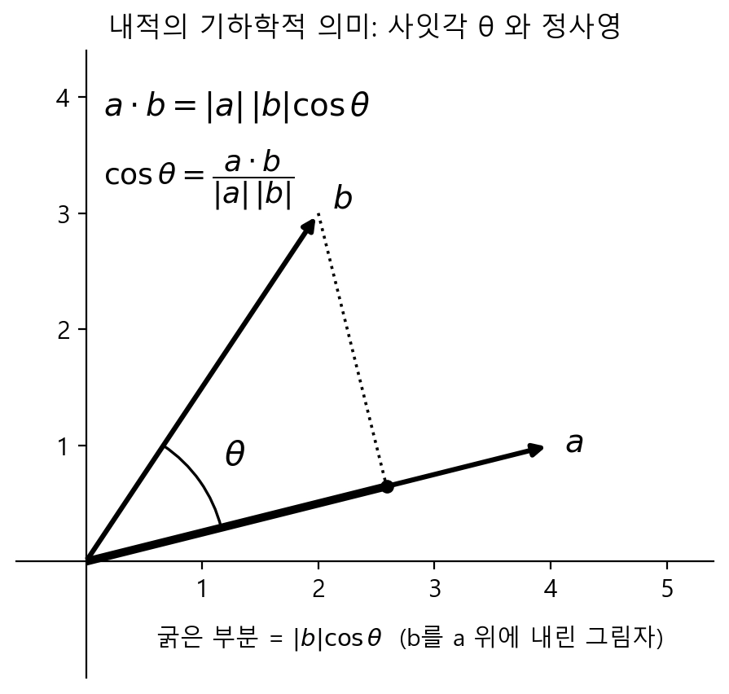

# 벡터의 내적과 코사인 유사도

## 오늘의 질문

두 벡터가 얼마나 닮았는지 하나의 숫자로 비교할 수 있을까?

## 핵심 결론

> 두 벡터의 내적을 이용하면 방향이 얼마나 일치하는지 알 수 있지만, 내적은 벡터의 크기에도 영향을 받는다. 따라서 내적을 두 벡터 크기의 곱으로 나눈 코사인 유사도를 사용하면 방향의 유사성을 하나의 숫자로 비교할 수 있다.

## 개념 정리

### 내적이란

내적(dot product)은 두 벡터의 같은 위치에 있는 성분끼리 곱한 뒤 모두 더하는 연산이다.

$$
\mathbf{a} \cdot \mathbf{b}
= a_1 b_1 + a_2 b_2 + \cdots + a_n b_n
= \sum_{i=1}^{n} a_i b_i
$$

```py
import numpy as np

a = np.array([1, 2, 3])
b = np.array([4, 5, 6])

dot = np.dot(a, b)  # 32
dot2 = a @ b        # 32, 동일한 결과
```

#### 내적과 각도

두 벡터의 내적은 벡터의 크기와 두 벡터 사이 각도의 코사인 값을 곱한 것과 같다.

$$
\mathbf{a} \cdot \mathbf{b}
= \|\mathbf{a}\| \|\mathbf{b}\| \cos\theta
$$

두 벡터의 크기가 같다면 방향이 비슷할수록 내적은 커지고, 수직이면 내적은 0이 된다. 반대 방향이면 내적은 음수가 된다.



### 코사인 유사도

내적은 벡터의 크기에도 영향을 받는다. 벡터의 크기와 관계없이 방향만 비교하려면 내적을 두 벡터 크기의 곱으로 나눈다.

$$
\mathrm{cosine\ similarity}(\mathbf{a}, \mathbf{b})
=
\frac{\mathbf{a} \cdot \mathbf{b}}
{\|\mathbf{a}\| \|\mathbf{b}\|}
$$

코사인 유사도는 일반적으로 $-1$과 $1$ 사이의 값을 가진다.

- $1$에 가까울수록 같은 방향이다.
- $0$이면 두 벡터가 수직이다.
- $-1$에 가까울수록 반대 방향이다.

단, 크기가 0인 벡터는 나눗셈을 할 수 없으므로 코사인 유사도를 계산할 수 없다.

```py
cosine_similarity = dot / (np.linalg.norm(a) * np.linalg.norm(b))

print(cosine_similarity)  # 약 0.9746
```

## 실제 활용

### 임베딩 공간에서 유사도 검색이 동작하는 방식

텍스트나 이미지를 숫자 벡터로 변환한 것을 임베딩(embedding)이라고 한다.

임베딩 공간에서는 의미가 비슷한 대상이 비슷한 방향을 갖도록 학습된다.

따라서 질문 벡터와 코사인 유사도가 높은 문서 벡터를 찾으면 질문과 관련 있을 가능성이 높은 문서를 검색할 수 있다.

### 딥러닝의 가중합과 어텐션

완전 연결층에서 입력과 가중치의 곱을 모두 더하는 가중합 계산은 내적이다.

트랜스포머의 어텐션 메커니즘에서도 쿼리와 키 벡터의 내적으로 두 위치가 얼마나 관련 있는지 계산한다.

## 한 문장 요약

내적을 두 벡터 크기의 곱으로 나눈 코사인 유사도는 벡터의 크기와 관계없이 두 벡터의 방향이 얼마나 비슷한지를 나타낸다.
