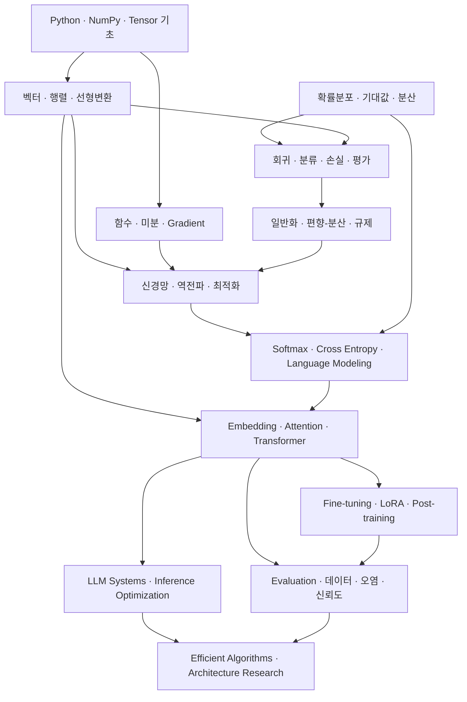

# Course Map

이 지도는 전체 KANT PDF 분석 전의 **초기 구조입니다.** PDF가 모두 업로드되면 실제 강의 범위, 중복, 선수지식을 기준으로 갱신합니다.

## 전체 의존성

## 권장 학습 순서

### 1. 계산과 표현의 기반 — P0

1. Python sequence, NumPy array, PyTorch Tensor의 차이
2. 벡터, 행렬, 축(axis), shape
3. 원소별 곱과 행렬곱
4. 내적, norm, cosine similarity
5. 선형변환, 기저, rank
6. 미분, 편미분, gradient, chain rule
7. 확률변수, 분포, 기대값, 분산

### 2. 머신러닝의 일반화 — P0

1. 회귀와 분류
2. 손실 함수와 평가 지표의 차이
3. train/validation/test와 데이터 누수
4. gradient descent
5. 편향-분산과 과적합·과소적합
6. 규제와 모델 복잡도
7. 배깅과 랜덤포레스트의 분산 감소

### 3. 딥러닝 — P0

1. affine layer와 activation
2. computational graph
3. backpropagation
4. initialization, normalization, regularization
5. optimizer와 learning-rate dynamics
6. PyTorch autograd와 training loop

### 4. Transformer와 언어모델 — P0

1. logits와 probability
2. softmax와 cross entropy
3. tokenization과 embedding
4. $Q$, $K$, $V$ projection
5. $QK^\top$와 attention score
6. scaling, masking, weighted sum
7. multi-head attention
8. residual, normalization, MLP
9. autoregressive language modeling

### 5. 목표 직무 연결 — P1

1. LLM evaluation design
2. data contamination, leakage, judge reliability
3. SFT, LoRA, QLoRA
4. preference optimization과 post-training
5. inference serving, batching, KV cache
6. quantization, speculative decoding, parallelism
7. profiling, latency, throughput, memory
8. reproducible experiment design

### 6. 현재는 필요 시 조회 — P2

- scikit-learn 세부 API
- plotting 옵션
- 프레임워크별 보일러플레이트
- 수치해석 알고리즘의 세부 구현
- 수학적 정리의 완전한 증명

## 현재 저장소에서 확인된 학습 흔적

다음은 기존 파일에서 확인된 주제일 뿐, 숙달을 뜻하지 않습니다.

- 벡터와 기하학적 해석
- 내적과 cosine similarity
- 선형변환
- 연립방정식과 행렬 해법
- 직교성과 최소제곱
- 고유값·고유벡터
- 대각화, PCA, SVD, low-rank approximation
- ML 문제 유형, 데이터 분리, 평가 지표
- 모델 선택 기준
- 배깅과 랜덤포레스트
- 편향-분산과 학습곡선
- Attention score와 $QK^\top$ shape

각 주제는 `curriculum/progress.md`의 진단을 거쳐 상태를 확정합니다.
